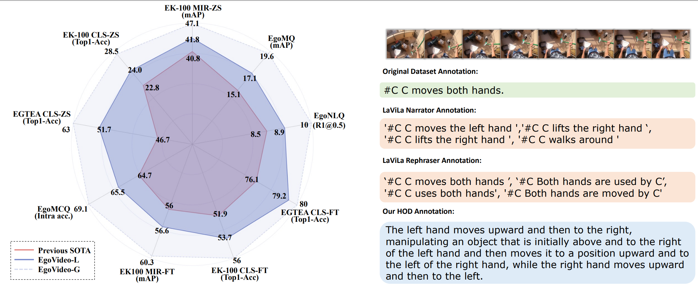
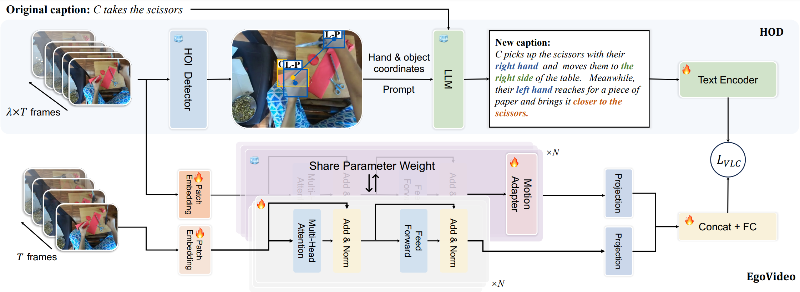

# EgoHOD

This repo is the official implementation of EgoHOD at ICLR 2025

> **["Modeling Fine-Grained Hand-Object Dynamics for Egocentric Video Representation Learning"](https://openreview.net/forum?id=P6G1Z6jkf3)**<br>
> [Baoqi Pei](https://scholar.google.com/citations?user=sTCkd54AAAAJ), [Yifei Huang](https://scholar.google.com/citations?user=RU8gNcgAAAAJ), [Jilan Xu](https://scholar.google.com/citations?user=mf2U64IAAAAJ), [Guo Chen](https://scholar.google.com/citations?user=lRj3moAAAAAJ), Yuping He, [Lijin Yang](https://scholar.google.com/citations?user=ppR-rpkAAAAJ),<br> 
> [Yali Wang](https://scholar.google.com/citations?user=hD948dkAAAAJ), [Weidi Xie](https://scholar.google.com/citations?user=Vtrqj4gAAAAJ), [Yu Qiao](https://scholar.google.com/citations?user=gFtI-8QAAAAJ), [Fei Wu](https://scholar.google.com/citations?user=XJLn4MYAAAAJ), [Limin Wang](https://scholar.google.com/citations?user=HEuN8PcAAAAJ)<br>

<div align="center">

</div>

## Todo

- [x] HOD data release
- [x] Pretrained code release
- [ ] Finetuned code release
- [x] Pretrained model checkpoints release
- [ ] Finetuned model checkpoints release
- [x] Evaluation code release

## Introduction

In egocentric video understanding, the motion of hands and objects as well as their interactions play a significant role by nature. However, existing egocentric video representation learning methods mainly focus on aligning video representation with high-level narrations, overlooking the intricate dynamics between hands and objects. In this work, we aim to integrate the modeling of fine-grained hand-object dynamics into the video representation learning process.
Since no suitable data is available, we introduce HOD, a novel pipeline employing a hand-object detector and a large language model to generate high-quality narrations with detailed descriptions of hand-object dynamics. 
To learn these fine-grained dynamics, we propose EgoVideo, a model with a new lightweight motion adapter to capture fine-grained hand-object motion information. Through our co-training strategy, EgoVideo effectively and efficiently leverages the fine-grained hand-object dynamics in the HOD data. Extensive experiments demonstrate that our method achieves state-of-the-art performance across multiple egocentric downstream tasks, including improvements of 6.3% in EK-100 multi-instance retrieval, 5.7% in EK-100 classification, and 16.3% in EGTEA classification in zero-shot settings. Furthermore, our model exhibits robust generalization capabilities in hand-object interaction and robot manipulation tasks.

<div align="center">

</div>


## Installation
```
git clone https://github.com/OpenGVLab/vinci.git
conda env create -f environment.yml
conda activate hod
pip install -r requirements.txt
```

## Datasets

You can get our HOD annotations from this [Huggingface link](https://huggingface.co/Jazzcharles/EgoInstructor-ModelZoo/blob/main/retrieval_checkpoint_best.pt).

## Pretraining

For training EgoVideo model without adapter, you can simply run the following code:
```shell
bash ./exps/pretrain.sh
```
**Notes:**
1. Modify the yml files in `./configs` before running the scripts.
2. For training without slurm script, you can simply run 
      ```shell
      python main_pretrain.py --config_file configs/clip_base.yml
      ```
3. For model with Adapter, we will release the pretraining code soon.

## Finetuning

We will update the code soon.

## Zero-shot Evaluation

For zero-shot evaluation, you can simply run the scripts in `exps` as follows:
```shell
bash exps/eval_ekcls.sh
```
We provide the evaluation code for EK100-MIR, EK100-CLS, EGTEA, and EGOMCQ.
## Cite

If you find this repository useful, please use the following BibTeX entry for citation.

```latex
@misc{li2023unmasked,
      title={Unmasked Teacher: Towards Training-Efficient Video Foundation Models}, 
      author={Kunchang Li and Yali Wang and Yizhuo Li and Yi Wang and Yinan He and Limin Wang and Yu Qiao},
      year={2023},
      eprint={2303.16058},
      archivePrefix={arXiv},
      primaryClass={cs.CV}
}
```

## Acknowledgement

This repository is built based on [mae](https://github.com/facebookresearch/mae) and [AVION](https://github.com/zhaoyue-zephyrus/AVION). Thanks to the contributors of the great codebase.
